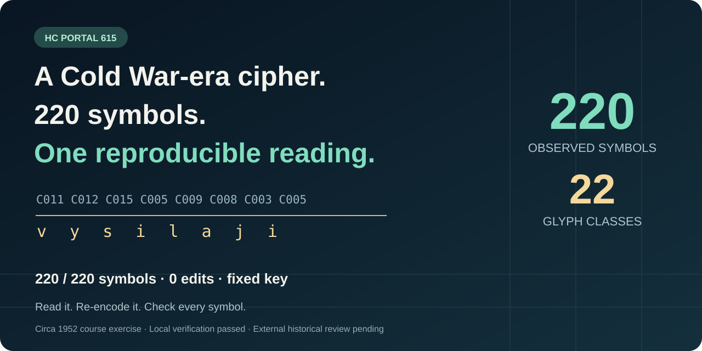

# HC615

## 冷戦期の暗号。220 の記号。検証できる全文解読。



[English](README.md) · [简体中文](README.zh-CN.md) · [Čeština](README.cs.md) · **日本語**

**著者：** Zijian Zeng, PhD · **リポジトリ：** [hc615-cold-war-cipher-decoded](https://github.com/ArtificialZeng/hc615-cold-war-cipher-decoded) · **版：** v1.0.1

公開目録で **「Not solved（未解読）」** とされていた暗号文に、全文を検証できるチェコ語の読みが得られました。**1 つの固定置換表で、観測された 220 の記号すべてを説明できます。訂正、無意味なダミー記号、位置ごとの例外はいずれもゼロです。** このリポジトリでは、結果を自分で確かめられます。

**220 記号 · 22 種類の字形 · 原資料の 32 区分 · 8 行 · 不一致 0**

原資料はチェコの *Archiv bezpečnostních složek* に所蔵される**暗号分析講習の演習問題**です。HC Portal の目録では **1952 年頃**とされています。明文は、オストラヴァ地方への労働者の派遣について述べています。Transporta は 9 人の同志を 1 年間の労働支援に送り出しました。全文の各文字が、同じ可逆な鍵に従っています。

**2026-10-05 時点の整理状況：**観測された全文の解読とローカル検証は完了しています。最終アクセス時、公開目録の表示は「Not solved」のままでした。外部専門家による確認、講習の原解答との照合は未実施です。世界初の解読とは主張していません。[結論の範囲](docs/CLAIMS.md)。

## 数秒で検証

Python 3.9 以降を使い、リポジトリのルートで実行します。

```sh
python3 scripts/verify_solution.py
```

Python 標準ライブラリだけで動くオフライン検証です。明文、22 項目の鍵、保存された字形転記を照合し、保存済みハッシュと探索出力を調べ、**220/220 記号、32/32 区分、8/8 行**の対応を確認します。同梱のチェコ語統計キャッシュで、保存済みのスコアも再計算します。外部 AI サービス、新たなモデル学習、探索の再実行は不要です。

原画像を取得し、記録された SHA-256 との一致も必須にする場合：

```sh
python3 scripts/fetch_sources.py --archive-image
python3 scripts/verify_solution.py --require-source-image
```

画像は Git の対象外のキャッシュに保存されます。ハッシュの一致はファイルの同一性を確認するもので、転記で字形を正しく区別しているかは、人が原画像と照合できます。原画像の再配布権は確認されていないため、画像そのものは同梱せず、元の提供サイトから取得します。

## 明文の全文

以下は、**改変していないソルバーの出力**です。原資料の 8 行に合わせて表示しています。アクセント記号、大文字・小文字の使い分け、句読点を原文の組版として復元したものではありません。

```text
vysilaji na ostravsko nejlepsi
pracovniky chrudimska transporta
vyslala devet soudruhu na jednorocni
brigadu jsou mezi nimi clenove
celozavodniho vyboru organisace
sami se prihlasili ostrava potrebuje
brigadniky kteri maji zkusenosti z
politicke prace
```

日本語での大意：優秀な労働者をオストラヴァ地方へ送る。Transporta は 9 人の同志を 1 年間の労働支援に送り出した。その中には組織の全工場委員会の委員もいる。彼らは自ら志願した。オストラヴァでは、政治活動の経験を持つ支援労働者が必要とされている。

ASCII の `chrudimska` には 2 通りの編集上の読みがあります。会社を修飾する **Chrudimská Transporta**、またはフルディム地方の労働者を指す **pracovníky Chrudimska** とし、Transporta の前で文を区切る読みです。暗号の文字だけでは、原文のアクセントや句読点を確定できません。歴史的な綴り **`organisace`** はそのまま残しています。

[変更のない明文](data/solution/PLAINTEXT_ASCII.txt)、[観測された字形の鍵](data/solution/OBSERVED_GLYPH_KEY.json)、[出典と来歴](docs/PROVENANCE.md)を参照してください。

## 解読までの手順

1. **証拠を先に固定する。** 言語推論の前に原画像を転記し、似た字形も別の種類として保持しました。各出現位置には原画像上の座標があります。赤い区切りを単語境界とみなすことも、明示的な仮説としました。
2. **ソルバーを校正する。** 長さと構造を合わせた 6 件のチェコ語の人工置換暗号で、推論時には正解を隠して評価しました。平均文字復元率は **99.6708%** でした。これは対照課題でのソフトウェアの性能であり、本題の正答確率ではありません。
3. **事前登録した本題の探索を 1 回実行する。** 古典的な全単射の単一換字ソルバーに、固定したチェコ語の 4-gram モデルを使用しました。シードは **615499**、変更試行数は **16 × 32768** です。保存された 16 回の再始動すべてが、同じ全文と、観測された 22 種類の同じ対応表に到達しました。
4. **答えを反証できるか調べる。** 別々の AI エージェントとプログラムによる監査で、原資料、チェコ語全文の整合性、入力、全探索結果のスコア、220 記号の再暗号化を検証しました。外部の学術専門家による承認を意味するものではありません。

明文はソルバーの実際の出力です。大規模言語モデルが作った流暢な文章を、解読結果として置き換えたものではありません。仕組みは古典的な単一換字式暗号であり、成果は、透明性のある全文の復元と再現可能な証拠一式です。[方法、設定、対照実験、限界](docs/METHODS.md)。

探索全体を再実行するには C++17 コンパイラが必要です。

```sh
python3 scripts/reproduce.py --controls
python3 scripts/reproduce.py --target
python3 -m unittest discover -s tests -v
```

登録したシードと探索回数は保存しています。コンパイラや C++ 標準ライブラリの違いにより、乱数探索の経路が変わる可能性があるため、異なる環境で最適化出力がバイト単位で一致するとは保証しません。固定した鍵によるオフライン検証は、その再探索に依存しません。

## 原資料と外部確認

- [HC Portal 615 の原目録](https://api.hcportal.eu/api/cryptograms/615)。題名は **「Unsolved cryptogram in 11 210」**。
- [原画像](https://api.hcportal.eu/media/1762/14161684790141.jpg)。
- 目録が示す所蔵番号：**Archiv bezpečnostních složek · ZSGS · box BF388a · 27-19/6-099**。
- [HC Portal 担当者と関連専門家の役職・公開連絡先・確認元](docs/EXPERT_CONTACTS.md)。

観測されたメッセージ全体は説明されています。使用されていない **f、q、w、x** に対応する歴史的な暗号記号は **UNKNOWN** のままです。原文のアクセントと句読点、記事の出典、差出人と受取人、講習の原鍵は独立に確定していません。16 回の一致は、数学的な一意性や世界初の発見を証明しません。

検証する方にとっての中心的な問いは、**この 1 つの固定鍵が原資料全体を説明するか、そして得られたチェコ語が全文として意味をなすか**です。このリポジトリは、両方を検査し、異議を唱えるための材料を残しています。

## 利用条件と引用

コード、プロジェクト独自の解説、第三者の言語データには、それぞれ異なるライセンスがあります。[出典と帰属](docs/PROVENANCE.md)を参照してください。同梱のチェコ語モデルと任意取得の上流コーパスには **CC BY-NC-SA 4.0** の条件が適用されます。原画像とダウンロードした上流コーパスは、バージョン管理対象に含めません。

引用には [CITATION.cff](CITATION.cff) を使用してください。公開説明には [CLAIMS.md](docs/CLAIMS.md) の検証済みの表現と、[PUBLICATION_STATUS.md](docs/PUBLICATION_STATUS.md) の実際の公開状況を確認してください。

**全文を読む。再暗号化する。すべての記号を確かめる。**

## 図入り広報資料

[中国語の技術ニュース形式の Word 原稿](press/HC615_冷战档案密码_科技报道图文稿.docx)には五つのオリジナル図と全文を収録しています。[四言語の広報原稿](press/README.md)もあります。外部専門家による確認は未了です。
